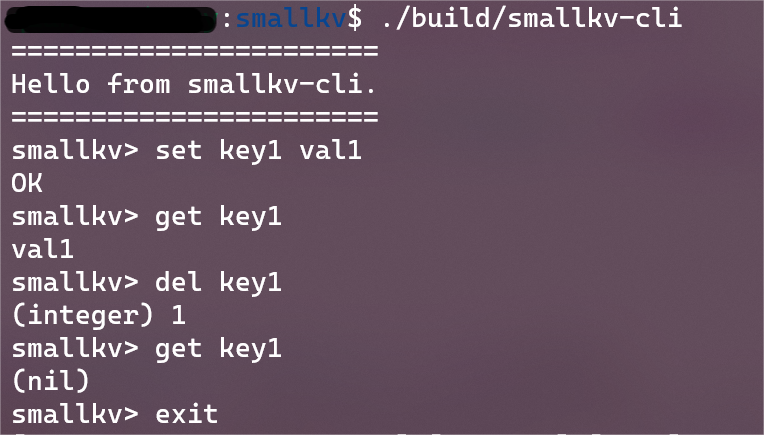
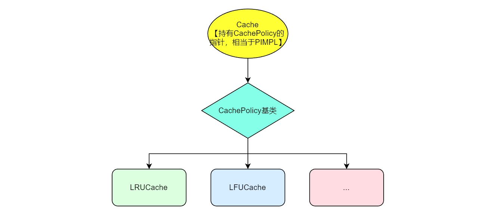
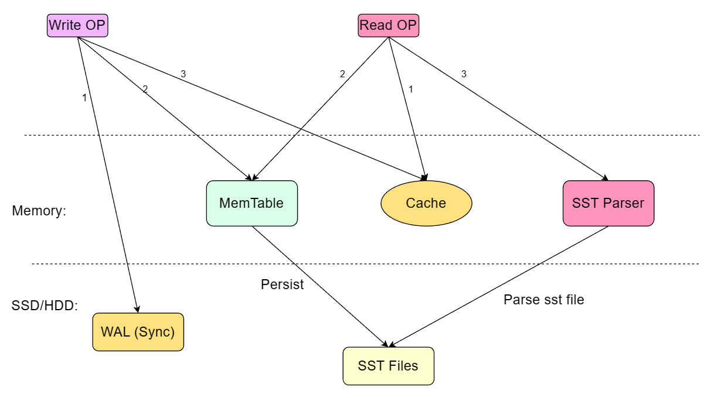

--------------------------------------------------------------------------------


[](https://github.com/yangyang233333/smallkv)
[](https://github.com/yangyang233333/smallkv/blob/master/LICENSE)

这个项目主要源于一次阿里云的newsql数据库大赛参赛经历，
由于比赛中写的架构较为简略，所以在这里重构一下这个kv引擎。
smallkv 是一个列存的、基于LSM架构的存储引擎。

**项目正在疯狂迭代中！！**

**Attention**: This is a toy project, so it cannot be used in production environment.
---

## 客户端演示

基本操作类似Redis，如下图所示：  


## 进度

- [x] 跳表
- [x] 布隆过滤器
- [x] 内存池
- [x] 缓存模块
- [x] FileWriter/FileReader(todo: 支持mmap)
- [x] SSTable
- [ ] MANIFEST
- [x] WAL模块
- [x] memtable
- [x] 读流程
- [x] 写流程
- [ ] BatchPut、BatchDelete
- [ ] Compaction模块
- [ ] 用FreeListAllocate(src/memory/allocate.h)替换系统内存分配器
- [x] 简易客户端：smallkv-cli

---

## BUILD

You must use the g++ compiler(with C++ 17 supported) and Ubuntu 22.04 system.

### build from docker (Highly recommended)

```shell
git clone git@github.com:yangyang233333/smallkv.git
docker pull qianyy2333/smallkv-test
docker run -it -v /{smallkv代码所在的目录}:/test qianyy2333/smallkv-test /bin/bash
./build.sh         ## 编译
./main_run.sh      ## 主程序
./unittest_run.sh  ## 单元测试
```

### build from source code:

```shell
# 安装依赖
apt update && apt upgrade -y && apt install cmake make git g++ gcc -y && cd ~ \
    && git clone https://github.com/gabime/spdlog.git && cd spdlog && mkdir build && cd build && cmake .. && make -j && sudo make install && cd ~ \
    && git clone https://github.com/google/googletest && cd googletest && mkdir build && cd build && cmake .. && make -j && sudo make install && cd ~ \
    && git clone https://github.com/nlohmann/json && cd json && mkdir build && cd build && cmake .. && make -j && sudo make install && cd ~ \
    && git clone https://github.com/abseil/abseil-cpp.git && cd abseil-cpp && mkdir build && cd build && cmake .. && make -j && make install && cd ~ \
    && rm -rf spdlog googletest json
git clone git@github.com:yangyang233333/smallkv.git
cd smallkv
./build.sh         ## 编译
./main_run.sh      ## 主程序
./unittest_run.sh  ## 单元测试
```

---

## 设计

### 1. **内存池设计**


### 2. **缓存设计**


Cache中持有N（默认为5）个指向CachePolicy的指针，相当于5个分片，可以减少哈希冲突以及减少锁的范围；LRUCache和LFUCache都是CachePolicy的子类。

### 3. **SSTable设计**

每个.sst文件存储一个SSTable结构，SSTable结构如下所示：    

下面细说每个模块的内容：

- #### 3.1 DataBlock


1）上图中，每个Record存储了具体的KV数据，并且记录了连续的Key的共享长度（为了差值压缩）；  
2）Restart主要用来进行二分查找，根据Restart中记录的offset信息可以解析出对应的Record
Group中最小的Key，通过比对连续的Restart中的Key可以快速定位K-V pair，每个Restart记录了一个Record
Group中的Record数量，以及对应的size和offset，每个Restart长度为12字节；  
3）Restart_NUM记录了Restart的数量；  
4）Restart_Offset记录了Restart的size和offset信息；

- #### 3.2 MetaBlock

MetaBlock中存储了Filter信息（位数组和哈希函数个数），也就是布隆过滤器的数据。为什么需要这个数据？因为sst是顺序append结构，所以写入很快（O(
1)），但是查找非常慢（O(N)），于是需要一个布隆过滤器来对请求进行初步的过滤（可以过滤掉一定不存在的KV pair）。

- #### 3.3 IndexBlock


IndexBlock存储对应的DataBlock中的最大key信息（注意：实际存储的是shortest_key，并且shortest_key = min{shortest_key >
对应的DataBlock的最大key}，这样可以减小比较次数，缓解高并发下的压力）；Offset_Info存储了对应DataBlock的size和offset。

- #### 3.4 Footer


MetaBlock_OffsetInfo记录了MetaBlock的size和offset，IndexBlock_OffsetInfo记录了IndexBlock的offset（第一个IndexBlock的offset）和size（所有IndexBlock的总大小）。

### 4. **Read/Write Op**

- #### 4.1 Read
先读缓存, 有则立即返回; 否则读memtable, 有则立即返回; 否则使用SST Parser解析磁盘的SST文件，找到对应的key.

- #### 4.2 Write
先写wal, 保证数据安全; 在写memtable和cache. 

---

## 第三方依赖：

1. [spdlog](https://github.com/gabime/spdlog)
2. [gtest](https://github.com/google/googletest)
3. [nlohmann/json](https://github.com/nlohmann/json)
4. [abseil](https://github.com/abseil/abseil-cpp)

---

## 有用的参考资料：

1. [阿里云NewSQL数据库大赛](https://tianchi.aliyun.com/competition/entrance/531980/introduction)
2. [corekv](https://github.com/hardcore-os/coreKV-CPP)
3. [leveldb](https://github.com/google/leveldb)
4. [Linux I/O: fsync, fflush, fwrite, mmap](https://juejin.cn/post/7001665675907301412)

---

Thanks to [JetBrains](https://jb.gg/OpenSourceSupport) for donating product licenses to help develop **smallkv
** <a href="https://jb.gg/OpenSourceSupport"></a>
